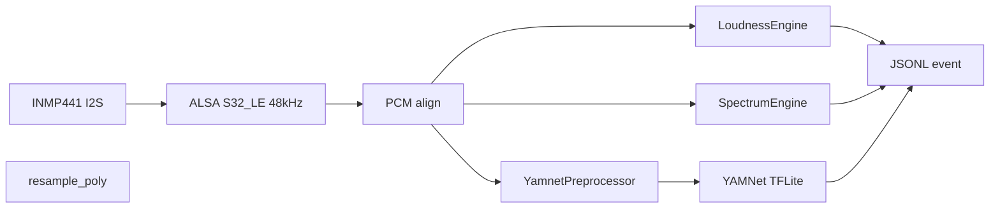

# Urban Sound Collector

Raspberry Pi edge collector for live urban noise monitoring.

Captures audio from an **INMP441 I2S microphone**, aligns 24-bit PCM from ALSA,
computes **A-weighted loudness (relative dBA)**, classifies sound events with
**bundled YAMNet TFLite**, and streams results as **JSON Lines** for logging or
later dashboard ingestion.

---

## Refactor goals

The original prototype used `sounddevice` + TensorFlow Hub SavedModel with a
`x15` software gain hack to compensate for quiet INMP441 levels. That worked for
near-field sounds but corrupted loudness telemetry and made outdoor traffic hard
to classify reliably.

This refactor targets a **modular, Pi-native edge pipeline**:

| Before | After |
|---|---|
| `sounddevice` float capture | ALSA `S32_LE` int32 @ 48 kHz |
| Global digital gain | Correct 24-bit PCM alignment (`>> 8`, `/ 2^23`) |
| TensorFlow Hub SavedModel | Bundled **YAMNet TFLite** (lighter, offline) |
| Single RMS metric | **Dual branch**: loudness + classification |
| WAV/file testing path | Live capture only |

Classifier input uses **dynamic preprocessing** (HPF, L90 adaptive silence gate, RMS
normalization with peak limiting, gain smoothing). Loudness and spectrum stay ungained.

---

## Architecture

Each ~0.975 s window flows through two parallel branches from one PCM buffer:

```text
INMP441 (I2S) → ALSA S32_LE @ 48 kHz
        │
        ▼
  int32 → PCM align → float32 [-1, 1]
        │
        ├─ Branch A (48 kHz) ──────────────────────────────┐
        │   A-weighting IIR (stateful)                     │
        │   rms_unweighted, rms_a_weighted, dBA_spl        │
        │                                                  │
        ├─ Branch C (48 kHz) ──────────────────────────────┤
        │   Welch PSD → Z + A 1/3-octave summaries         │
        │   (ungained; peaks, centroid, rolloff, L/M/H)    │
        │                                                  │
        └─ Branch B (16 kHz) ──────────────────────────────┤
            HPF ~175 Hz → L90 silence gate → RMS normalize  │
            (smoothed gain, peak limiter) → resample     │
            YAMNet TFLite → top-3 predictions            │
                                                           ▼
                                              JSONL event per chunk
```



---

## Project structure

```text
urban-sound-collector/
├── main.py                     # CLI entry: capture loop, JSONL output
├── requirements.txt            # collector deps (numpy, scipy, pyalsaaudio)
├── .env.example                # web UI config template
├── .gitattributes              # enforce LF line endings
├── README.md
├── core/
│   ├── audio_constants.py      # 48 kHz capture / 16 kHz YAMNet window sizes
│   ├── capture_alsa.py         # ALSA capture (pyalsa or arecord backend)
│   ├── pcm.py                  # int32 → aligned float32 normalization
│   ├── host_identity.py        # Hostname / DEVICE_ID defaults (multi-Pi)
│   ├── loudness.py             # A-weighting + relative dBA SPL
│   ├── spectrum.py             # Z + A 1/3-octave spectral summaries
│   ├── yamnet_preprocess.py    # HPF, dynamic normalize, silence gate
│   ├── resampler.py            # 48 kHz → 16 kHz for YAMNet
│   ├── classifier_tflite.py    # Bundled YAMNet TFLite inference
│   └── events.py               # JSONL event schema builder
├── tests/
│   ├── test_spectrum.py        # Spectrum unit tests (sine tones)
│   └── test_yamnet_preprocess.py
├── web/
│   ├── app.py                  # FastAPI web server
│   ├── auth.py                 # Session-based password login
│   ├── requirements-web.txt    # web-only deps (fastapi, uvicorn, …)
│   ├── install.sh              # First-time setup script (deps + cloudflared)
│   ├── urban-sound-web.service # systemd unit — auto-start web UI on boot
│   └── templates/
│       └── index.html          # Mobile-friendly UI
├── models/
│   ├── yamnet.tflite           # Bundled classifier (~4 MB)
│   └── yamnet_class_map.csv
├── runs/                       # Local JSONL output (gitignored)
└── logs/                       # Collector + web server logs (gitignored)
```

### Module responsibilities

| Module | Role |
|---|---|
| `main.py` | Argument parsing, orchestrates capture → analysis → JSONL |
| `capture_alsa.py` | Opens ALSA device, yields fixed-size int32 chunks |
| `pcm.py` | INMP441 24-bit alignment into unit-scale float samples |
| `loudness.py` | IEC 61672-style A-weighting, RMS, relative `dBA_spl` |
| `spectrum.py` | Welch PSD, 1/3-octave Z + A bands, peaks, centroid, rolloff |
| `yamnet_preprocess.py` | Branch B HPF, RMS normalize, gain smooth, silence gate |
| `resampler.py` | Polyphase resample 48 kHz → 16 kHz |
| `classifier_tflite.py` | Loads TFLite model, returns top-3 AudioSet labels |
| `events.py` | Builds one JSON object per chunk |

---

## JSONL event schema

One JSON object per line (~1 Hz):

```json
{
  "device_id": "pi-test-01",
  "created_at": "2026-08-12T14:14:34.317Z",
  "chunk_index": 0,
  "run_id": "2026-08-12T14-14-27Z",
  "rms_unweighted": 0.00851457,
  "rms_a_weighted": 0.0045808,
  "dBA_spl": 73.2,
  "top_label": "Vehicle",
  "top_confidence": 0.26171875,
  "predictions": [
    {"label": "Vehicle", "confidence": 0.26171875},
    {"label": "White noise", "confidence": 0.109375},
    {"label": "Car", "confidence": 0.08203125}
  ],
  "model_name": "yamnet",
  "model_version": "tflite/1",
  "spectrum": {
    "band_type": "third_octave",
    "centers_hz": [31.5, 40, 50, "..."],
    "z": {
      "levels_db": [-38.2, -35.1, "..."],
      "peaks": [{"hz": 50.2, "db": -15.1}, {"hz": 240.1, "db": -22.7}],
      "centroid_hz": 420.0,
      "rolloff_85_hz": 1800.0,
      "energy_pct": {"low": 62.0, "mid": 28.0, "high": 10.0}
    },
    "a": {
      "levels_db": [-42.0, -38.5, "..."],
      "peaks": [{"hz": 980.0, "db": -18.2}],
      "centroid_hz": 890.0,
      "rolloff_85_hz": 2100.0,
      "energy_pct": {"low": 35.0, "mid": 48.0, "high": 17.0}
    }
  },
  "yamnet_preprocess": {
    "gate_mode": "dynamic_l90",
    "gated": false,
    "applied_gain": 4.2,
    "raw_rms_dbfs": -42.1,
    "smoothed_rms_dbfs": -41.8,
    "hpf_hz": 175,
    "target_dbfs": -23,
    "ambient_noise_floor_dbfs": -78.2,
    "ambient_sample_count": 145,
    "ambient_window_chunks": 300,
    "ambient_percentile": 10,
    "gate_sensitivity_db": 8,
    "gate_hysteresis_db": 3,
    "silence_gate_open_dbfs": -70.2,
    "silence_gate_close_dbfs": -73.2,
    "gate_open": true,
    "gain_smooth_chunks": 5
  }
}
```

- **`created_at`**: UTC timestamp for time-series use
- **`chunk_index`**: per-run counter (resets on restart)
- **`dBA_spl`**: relative SPL (not absolute; no calibrated mic yet)
- **`yamnet_preprocess`**: Branch B diagnostics (dynamic gain, L90 silence gate)
- **`yamnet_preprocess.gated`**: `true` when YAMNet was skipped (labeled Silence)
- **`yamnet_preprocess.gate_open`**: hysteresis state — `false` when gated
- **`ambient_noise_floor_dbfs`**: L90 background floor (10th percentile of last ~5 min)
- **`silence_gate_open_dbfs` / `silence_gate_close_dbfs`**: per-chunk dynamic thresholds (open = floor + 8 dB, close = open − 3 dB)
- **`gate_sensitivity_db` / `gate_hysteresis_db`**: tuning parameters for the dynamic gate
- **`spectrum.z`**: unweighted (physical) frequency content — use for hum/rumble
- **`spectrum.a`**: A-weighted bands — aligns with human perception / `dBA_spl`
- **`spectrum.*.levels_db`**: relative band levels (not absolute per-band SPL)
- **`spectrum.*.energy_pct`**: low 31.5–500 Hz, mid 500–2000 Hz, high 2–16 kHz

Disable spectrum with **`--no-spectrum`** (Branch A + B only).

---

## Requirements

- Raspberry Pi 4/5, 64-bit OS (Bookworm)
- INMP441 on I2S (L/R → GND for mono Left)
- Python 3.11 venv recommended (`tflite-runtime` wheels)

---

## Setup (Pi)

```bash
sudo apt update
sudo apt install -y python3-venv python3-dev libasound2-dev alsa-utils
python3 -m venv .venv
source .venv/bin/activate
pip install -r requirements.txt
```

Find your ALSA device:

```bash
arecord -l
# typically plughw:3,0 for Google Voice HAT / INMP441
```

---

## Durability (crash / power loss)

JSONL is **append + flush + fsync** after every chunk (~1 Hz), so completed
events survive a process crash or power cut. At most the in-progress chunk is
lost.

Status/errors go to a **new file per run** under `logs/` (not `/tmp`, never
overwritten):

```text
logs/<device_id>_<run_id>.log
```

Heartbeat lines are written about once per minute so you can confirm progress
after a crash.

Do **not** redirect logs to `/tmp/urban-sound.log` — that path is wiped on
reboot and overwrites itself if reused.

---

## Run

```bash
mkdir -p runs logs
nohup timeout 3h python main.py \
  --device-id pi-test-01 \
  --alsa-device plughw:3,0 \
  --backend arecord \
  --quiet \
  -o "runs/evening-$(date -u +%Y-%m-%dT%H-%MZ).jsonl" \
  >/dev/null 2>&1 &
```

Collector logs still land in `logs/` (stderr is duplicated there). Check later:

```bash
pgrep -af "main.py"
ls -lh runs/ logs/
tail -n 20 logs/*.log
```

### Useful flags

| Flag | Default | Purpose |
|---|---|---|
| `--alsa-device` | `plughw:3,0` | ALSA capture device |
| `--backend` | `auto` | `pyalsa`, `arecord`, or `auto` |
| `--yamnet-hpf-hz` | `175` | Branch B high-pass cutoff (Hz) |
| `--yamnet-target-dbfs` | `-23` | Branch B RMS normalization target |
| `--yamnet-gate-sensitivity-db` | `8` | Open offset above L90 ambient floor (dB) |
| `--yamnet-gate-hysteresis-db` | `3` | Close offset below open threshold (dB) |
| `--yamnet-gate-ambient-chunks` | `300` | Rolling window for ambient floor (~5 min) |
| `--yamnet-gate-percentile` | `10` | Ambient floor percentile (L90 = 10) |
| `--yamnet-gain-smooth-chunks` | `5` | Gain smoothing window (chunks) |
| `--calib-offset` | `120.0` | Relative dBA offset |
| `--quiet` | off | Suppress JSON on stdout |
| `-o` | `runs/<device>_<run_id>.jsonl` | JSONL output (append + fsync) |
| `--no-spectrum` | off | Disable Branch C spectral analysis |
| `--log-dir` | `logs` | Per-run log directory |

Stop with **Ctrl+C**, or let `timeout` end the run.

### Tests

```bash
python -m unittest discover -s tests -v
```

---

## Web UI (remote control + monitoring)

A FastAPI web interface lets you start/stop runs and monitor status from any
device — phone, PC, anywhere on the internet — via a **Cloudflare Tunnel**
(free, no port forwarding, automatic HTTPS).

### Features

- Start a run with:
  - **Hours** input (e.g. `8`, or `168` for a week)
  - **Output file name** prefix (prefilled from time of day: `morning` /
    `day` / `evening` / `night`); UTC start stamp is always appended
  - Device ID and ALSA device
  - **Gate sensitivity (dB above ambient)** — default `8`; L90 dynamic gate adapts
    to urban background over a ~5-minute window (300 chunks)
- Stop a running run
- Live status: chunk count, elapsed time, last label, dBA (polls every 10 s)
- Live log tail via Server-Sent Events (no page refresh needed)
- Download past JSONL files directly in the browser, with optional
  **download granularity** (omit `spectrum` and/or `yamnet_preprocess` to shrink files)
- Password-protected login (session cookie, 7-day expiry)
- Optional **systemd** unit so the web UI auto-starts on Pi reboot
- Named Cloudflare Tunnel for a stable public URL (e.g. `https://noise.mattszaszko.com`)

---

### How Cloudflare Tunnel works

```
Your phone / browser (anywhere on the internet)
          ↓  HTTPS
  *.trycloudflare.com  ←  Cloudflare's global network
          ↓  encrypted outbound tunnel
  cloudflared process on the Pi
          ↓  localhost:8080
  FastAPI web server
```

The Pi makes an **outbound** connection to Cloudflare — no open router ports,
no static IP, no DNS setup required. Cloudflare relays browser traffic back
through the tunnel.

The free `trycloudflare.com` URL is **random and changes** every time
`cloudflared` restarts. For a permanent URL, set up a named tunnel tied to a
domain (free at [dash.cloudflare.com](https://dash.cloudflare.com)).

---

### First-time setup on the Pi

**1. Push the code** (from PowerShell on your PC):

```powershell
scp -r "C:\path\to\urban-sound-collector\web" matt@192.168.178.11:~/urban-sound-collector/
scp "C:\path\to\urban-sound-collector\.env.example" matt@192.168.178.11:~/urban-sound-collector/
```

**2. Run the install script** (on the Pi):

```bash
cd ~/urban-sound-collector
source .venv/bin/activate
# Strip Windows line endings if pushed from a Windows PC
sed -i 's/\r//' web/install.sh web/requirements-web.txt
bash web/install.sh
```

The script will:
- Install the 7 web Python packages
- Create `.env` from the template and prompt you to set a password (`nano .env`)
- Install `cloudflared` (ARM64 `.deb`)
- Start the web server in the background
- Start a Cloudflare Tunnel and print your public HTTPS URL

**3. Open the URL** on any device, enter your password, done.

---

### Named tunnel (stable URL)

Preferred setup: a named Cloudflare Tunnel on your domain, e.g.
`https://noise.mattszaszko.com` → `http://localhost:8080` on the Pi.

Install `cloudflared` as a systemd service from the Cloudflare Zero Trust
dashboard (Debian / 64-bit connector). Once that service is enabled, the tunnel
survives reboots automatically.

---

### Auto-start the web UI on boot (systemd)

Install the unit file so uvicorn starts after every reboot (no manual `nohup`):

```bash
# On the Pi — copy the unit and enable it
sudo cp ~/urban-sound-collector/web/urban-sound-web.service /etc/systemd/system/
sudo systemctl daemon-reload
sudo systemctl enable --now urban-sound-web
sudo systemctl status urban-sound-web
```

Useful commands:

```bash
sudo systemctl status urban-sound-web   # is it running?
sudo systemctl restart urban-sound-web  # after code/config changes
sudo journalctl -u urban-sound-web -f   # live logs
```

Stop any old manual uvicorn first so port 8080 is free:

```bash
pkill -f "uvicorn web.app:app" 2>/dev/null
```

After reboot you should have:

| Component | Status |
|---|---|
| `cloudflared` | Auto-starts (named tunnel) |
| `urban-sound-web` | Auto-starts (uvicorn on :8080) |
| Collector run | Manual via web UI when you want |

**Shut down from the web UI:** the **Power** section has a **Shut down Pi** button. It stops any active recording, waits one minute (configurable), then powers off. One-time setup so the web user can power off without a password:

```bash
sudo bash ~/urban-sound-collector/web/setup-shutdown-sudoers.sh
```

Keep the page open until the countdown finishes and you see **Safe to unplug power now**.

---

### Environment variables (`.env`)

| Variable | Default | Purpose |
|---|---|---|
| `USC_PASSWORD` | `changeme` | Web UI login password |
| `SECRET_KEY` | `change-me-please` | Session cookie signing key (auto-generated by `install.sh`) |
| `PORT` | `8080` | Web server port |
| `DEVICE_ID` | *(hostname)* | Logical id in JSONL; empty = Pi hostname |
| `SITE_LABEL` | *(empty)* | Human label shown in web UI (set per Pi) |
| `PUBLIC_URL` | *(empty)* | This Pi's public URL (set per Pi) |
| `ALSA_DEVICE` | `plughw:CARD=sndrpigooglevoi,DEV=0` | Default ALSA device in UI |
| `SHUTDOWN_GRACE_SEC` | `60` | Countdown before poweroff from web UI |

The `.env` file is gitignored — never commit it. Copy `.env.example` on each Pi.

---

## Multi-Pi deployment

Multiple Pis can run **at the same time**. Each Pi needs:

- Its own **Cloudflare tunnel** and **subdomain** (e.g. `noise.mattszaszko.com`, `noise-site-b.mattszaszko.com`)
- Its own **`.env`** with unique `SITE_LABEL`, `PUBLIC_URL`, and `SECRET_KEY`
- The same codebase (`git clone` on each device)

Do **not** install the same tunnel token on two Pis — traffic will be split randomly.

Full guide: **[docs/MULTI-PI.md](docs/MULTI-PI.md)**

---

## Crash durability

JSONL output uses **append + flush + `fsync`** after every chunk (~1 Hz), so
completed events survive a process crash or power cut. At most the current
~1 s chunk in progress is lost.

Logs go to `logs/<device>_<run_id>.log` — one file per run, never overwritten,
not in `/tmp`. A heartbeat line is written every ~60 chunks (~1 min) so you
can confirm progress after a crash.

Use `nohup ... & disown` when starting long runs so that closing SSH does not
kill the collector.

---

## Future work

- Firestore upload from the Pi (edge writer only)
- Optional overlap / shorter hop for faster label updates
