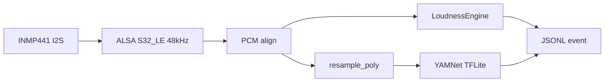

# Urban Sound Collector

Raspberry Pi edge collector for live urban noise monitoring.

Captures audio from an **INMP441 I2S microphone**, aligns 24-bit PCM from ALSA,
computes **A-weighted loudness (relative dBA)**, classifies sound events with
**bundled YAMNet TFLite**, and streams results as **JSON Lines** for logging or
later dashboard ingestion.

---

## Refactor goals

The original prototype used `sounddevice` + TensorFlow Hub SavedModel with a
`x15` software gain hack to compensate for quiet INMP441 levels. That worked for
near-field sounds but corrupted loudness telemetry and made outdoor traffic hard
to classify reliably.

This refactor targets a **modular, Pi-native edge pipeline**:

| Before | After |
|---|---|
| `sounddevice` float capture | ALSA `S32_LE` int32 @ 48 kHz |
| Global digital gain | Correct 24-bit PCM alignment (`>> 8`, `/ 2^23`) |
| TensorFlow Hub SavedModel | Bundled **YAMNet TFLite** (lighter, offline) |
| Single RMS metric | **Dual branch**: loudness + classification |
| WAV/file testing path | Live capture only |

Classifier-only **`--yamnet-gain`** remains optional for quiet outdoor sources
(window traffic). Loudness metrics are always ungained.

---

## Architecture

Each ~0.975 s window flows through two parallel branches from one PCM buffer:

```text
INMP441 (I2S) → ALSA S32_LE @ 48 kHz
        │
        ▼
  int32 → PCM align → float32 [-1, 1]
        │
        ├─ Branch A (48 kHz) ──────────────────────────────┐
        │   A-weighting IIR (stateful)                     │
        │   rms_unweighted, rms_a_weighted, dBA_spl        │
        │                                                  │
        └─ Branch B (16 kHz) ──────────────────────────────┤
            resample_poly (48k → 16k)                      │
            optional --yamnet-gain (classifier only)       │
            YAMNet TFLite → top-3 predictions              │
                                                           ▼
                                              JSONL event per chunk
```



---

## Project structure

```text
urban-sound-collector/
├── main.py                 # CLI entry: capture loop, JSONL output
├── requirements.txt        # numpy, scipy, pyalsaaudio, tflite-runtime
├── README.md
├── core/
│   ├── audio_constants.py  # 48 kHz capture / 16 kHz YAMNet window sizes
│   ├── capture_alsa.py     # ALSA capture (pyalsa or arecord backend)
│   ├── pcm.py              # int32 → aligned float32 normalization
│   ├── loudness.py         # A-weighting + relative dBA SPL
│   ├── resampler.py        # 48 kHz → 16 kHz for YAMNet
│   ├── classifier_tflite.py# Bundled YAMNet TFLite inference
│   └── events.py           # JSONL event schema builder
├── models/
│   ├── yamnet.tflite       # Bundled classifier (~4 MB)
│   └── yamnet_class_map.csv
└── runs/                   # Local JSONL output (gitignored)
```

### Module responsibilities

| Module | Role |
|---|---|
| `main.py` | Argument parsing, orchestrates capture → analysis → JSONL |
| `capture_alsa.py` | Opens ALSA device, yields fixed-size int32 chunks |
| `pcm.py` | INMP441 24-bit alignment into unit-scale float samples |
| `loudness.py` | IEC 61672-style A-weighting, RMS, relative `dBA_spl` |
| `resampler.py` | Polyphase resample + optional classifier gain + clip |
| `classifier_tflite.py` | Loads TFLite model, returns top-3 AudioSet labels |
| `events.py` | Builds one JSON object per chunk |

---

## JSONL event schema

One JSON object per line (~1 Hz):

```json
{
  "device_id": "pi-test-01",
  "created_at": "2026-08-12T14:14:34.317Z",
  "chunk_index": 0,
  "run_id": "2026-08-12T14-14-27Z",
  "rms_unweighted": 0.00851457,
  "rms_a_weighted": 0.0045808,
  "dBA_spl": 73.2,
  "top_label": "Vehicle",
  "top_confidence": 0.26171875,
  "predictions": [
    {"label": "Vehicle", "confidence": 0.26171875},
    {"label": "White noise", "confidence": 0.109375},
    {"label": "Car", "confidence": 0.08203125}
  ],
  "model_name": "yamnet",
  "model_version": "tflite/1"
}
```

- **`created_at`**: UTC timestamp for time-series use
- **`chunk_index`**: per-run counter (resets on restart)
- **`dBA_spl`**: relative SPL (not absolute; no calibrated mic yet)

---

## Requirements

- Raspberry Pi 4/5, 64-bit OS (Bookworm)
- INMP441 on I2S (L/R → GND for mono Left)
- Python 3.11 venv recommended (`tflite-runtime` wheels)

---

## Setup (Pi)

```bash
sudo apt update
sudo apt install -y python3-venv python3-dev libasound2-dev alsa-utils
python3 -m venv .venv
source .venv/bin/activate
pip install -r requirements.txt
```

Find your ALSA device:

```bash
arecord -l
# typically plughw:3,0 for Google Voice HAT / INMP441
```

---

## Run

```bash
python main.py \
  --device-id pi-test-01 \
  --alsa-device plughw:3,0 \
  --backend arecord \
  --yamnet-gain 15 \
  --quiet \
  -o runs/evening-test.jsonl
```

### Useful flags

| Flag | Default | Purpose |
|---|---|---|
| `--alsa-device` | `plughw:3,0` | ALSA capture device |
| `--backend` | `auto` | `pyalsa`, `arecord`, or `auto` |
| `--yamnet-gain` | `15.0` | Classifier-only boost; use `1` to disable |
| `--calib-offset` | `120.0` | Relative dBA offset |
| `--quiet` | off | Suppress JSON on stdout |
| `-o` | `runs/<device>_<run_id>.jsonl` | Output file |

Stop with **Ctrl+C**.

---

## Future work

- Firestore upload from the Pi (edge writer only)
- Device registry + dashboard (separate web project)
- Optional overlap / shorter hop for faster label updates
